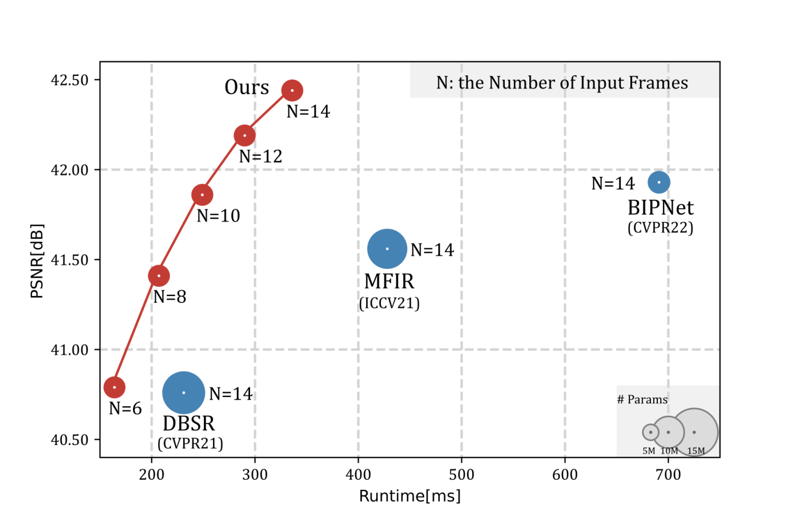

# RBSR: Efficient and Flexible Recurrent Network for Burst Super-Resolution

Official implementation of [RBSR: Efficient and Flexible Recurrent Network for Burst Super-Resolution](https://arxiv.org/abs/2306.17595)

## Performance and Runtime Comparison

<p align="center"></p>
<p align="center">Performance and runtime comparison on SyntheticBurst dataset.</p>


## Prerequisites

```bash
python 3.8.5, pytorch 1.12, mmcv-full 1.7.1
OpenCV, NumPy, Pillow, tqdm, scikit-image and tensorboardX.
```

## Datasets

<details>
<summary><b>SntheticBurst training dataset</b></summary>

Download the Zurich RAW to RGB canon set from [here](https://data.vision.ee.ethz.ch/bhatg/zurich-raw-to-rgb.zip) and unpack the zip file.
</details>

<details>
<summary><b>SyntheticBurst testing dataset</b></summary>

Downloaded the dataset [here](https://data.vision.ee.ethz.ch/bhatg/SyntheticBurstVal.zip) and unpack the zip file. 
</details>

<details>
<summary><b>real-world BurstSR traing and testing dataset</b></summary> 

The train and test dataset can be downloaded and unpacked using the 
[util_scripts/download_burstsr_dataset.py](util_scripts/download_burstsr_dataset.py) script. 
</details>

## Quick Start
### Pre-trained models

we provide the pre-trained models in the [./pretrained_networks] folder.


### Test on SyntheticBurst Dataset
You can test RBSR on SyntheticBurst dataset by running
```bash
python ./run_test_syn.py 
```
Please change the the `synburstval_dir` variable in [admin/local.py](admin/local.py) to your test dataset path.


### Test on BurstSR Dataset
You can test RBSR on BurstSR dataset by running
```bash
python ./run_test_real.py 
```
Please change the the `burstsr_dir` variable in [admin/local.py](admin/local.py) to your test dataset path.


## Train on SyntheticBurst Dataset 
You can train RBSR on SyntheticBurst dataset by running
```bash
python ./run_training.py dbsr RBSR_synthetic
```
Please change the the `zurichraw2rgb_dir` variable in [admin/local.py](admin/local.py) to your train dataset path.

## Train on SyntheticBurst Dataset 
You can train RBSR on BurstSR dataset by running
```bash
python ./run_training.py dbsr RBSR_realworld
```
Please change the the `burstsr_dir` variable in [admin/local.py](admin/local.py) to your train dataset path.

## Acknowledgement
- This implementation is based on[deep-burst-sr](https://github.com/goutamgmb/deep-burst-sr).
- We borrow some codes from [mmagic](https://github.com/open-mmlab/mmagic), which is an open-source image and video editing toolbox.
